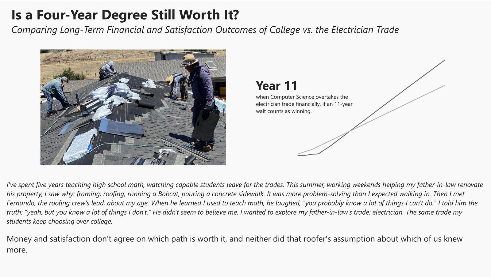
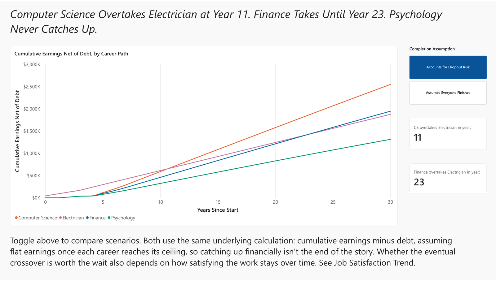
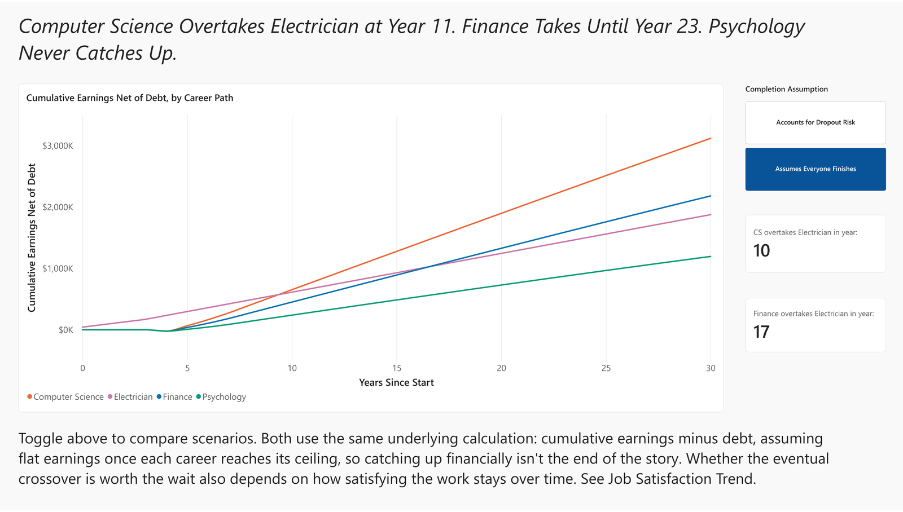
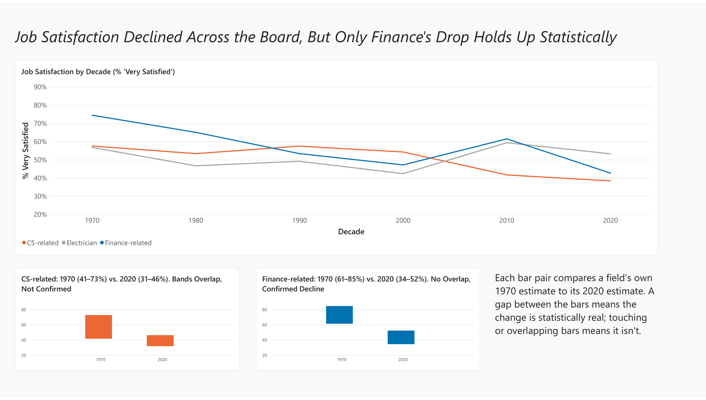
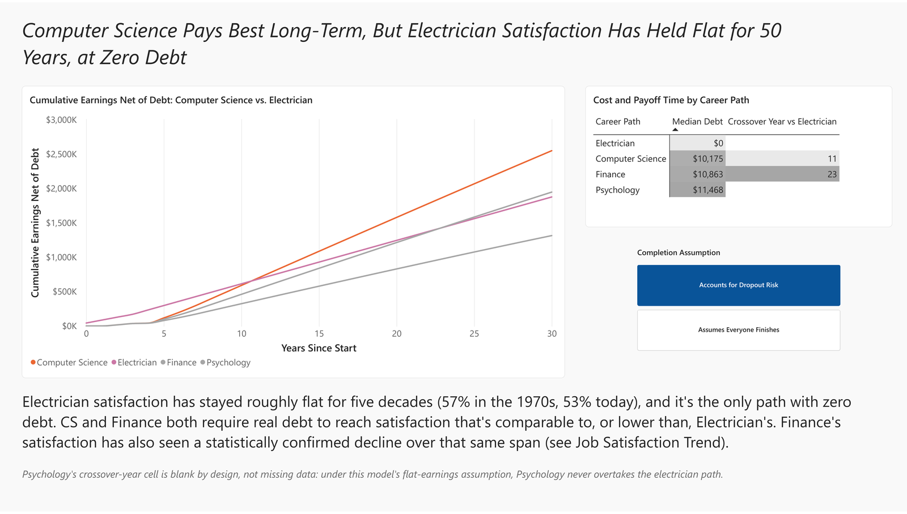
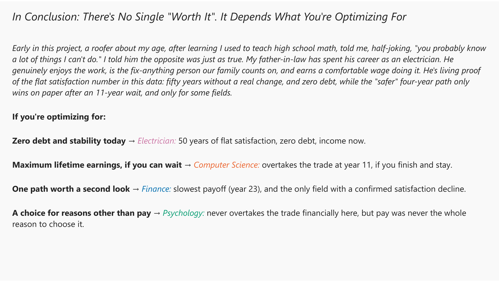
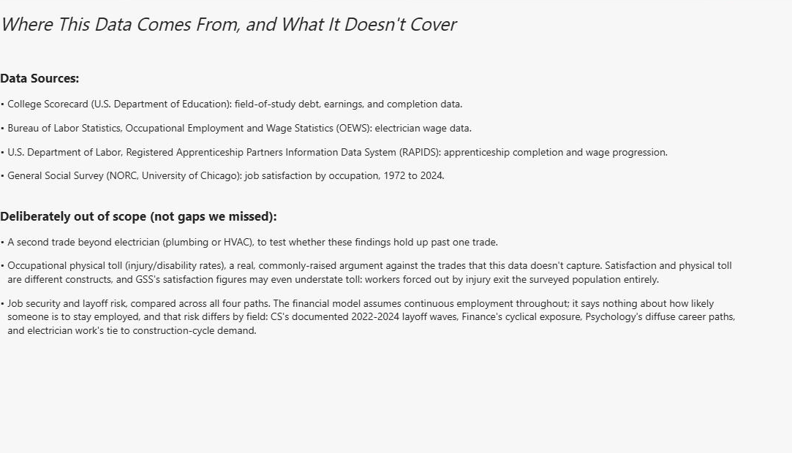

# Is a Four-Year Degree Still Worth It? College vs. Skilled Trades

## The Question

Comparing a four-year bachelor's degree against becoming an electrician, which path comes out ahead financially, and when? And separately: which path do people report being happier in? This project models the full financial trajectory (debt and earnings together, not just one or the other) and 50 years of job satisfaction data for three degree fields, Computer Science, Finance, and Psychology, against the electrician trade.

## Key Findings

- **Computer Science pays off, but not fast.** Even after pricing in the real risk of not finishing the degree, CS doesn't overtake the electrician trade's cumulative earnings until year 11. Finance takes until year 23. Psychology never does, under this model's assumptions.
- **Electrician holds a real financial lead for the first decade or more, at zero debt**, and satisfaction in the trade has stayed flat for fifty years: no statistically confirmed change across any of the six decades measured (checked exhaustively, every possible pair of decades overlaps).
- **Finance is the only field with a statistically confirmed decline in job satisfaction** (74.5% "very satisfied" in the 1970s down to 42.7% in the 2020s, confidence intervals that don't overlap), and it's also the slowest-paying-off degree in the study.
- **CS's satisfaction also drops on paper** (57.6% to 38.4%), but that drop's confidence intervals overlap across decades, so it can't be confirmed as a real change rather than sampling noise.
- **There's no single "worth it" answer.** It depends on what you're optimizing for and over what time horizon. Full reasoning in the presentation, full methodology in [METHODOLOGY.md](METHODOLOGY.md).

## Presentation

Built in Power BI (PBIP project format: the report unpacks to text, JSON visual/page definitions plus TMDL table/measure/Power Query definitions, editable directly rather than only through the GUI), six pages. Full interactive file: [college_vs_trades_presentation.pdf](college_vs_trades_presentation.pdf).

### 1. Opening

A summer spent working alongside my father-in-law (an electrician) on his property renovation, and meeting Fernando, a roofing crew lead, which is where this project's actual question came from.

### 2. Financial Trajectory

Cumulative earnings net of debt over time, all four paths, shown under both completion scenarios.

### 3. Job Satisfaction Trend

50 years of GSS satisfaction data by decade, with small-multiple confirmed/not-confirmed panels for CS and Finance.

### 4. Reconciling Money & Satisfaction

The two dimensions brought together, with a focused CS-vs-Electrician chart.

### 5. Closing

Decision framework by what you're optimizing for, and the callback to the opening story.

### 6. Sources & Scope

Full data source attribution and a stated list of what this project deliberately didn't model (a second trade, occupational physical toll, job security/layoff risk).

## Data Sources

- [College Scorecard](https://collegescorecard.ed.gov/data/) (U.S. Dept. of Education): field-of-study debt, earnings, and completion data
- [BLS OEWS](https://www.bls.gov/oes/): electrician wage data
- DOL Registered Apprenticeship (RAPIDS): apprenticeship completion and wage progression
- General Social Survey (GSS), NORC/University of Chicago: job satisfaction by occupation, 1972-2024

Full sourcing detail, exact figures, and data quality notes: see [METHODOLOGY.md](METHODOLOGY.md).

## Project Structure

- `/data/raw`: raw downloaded source files (College Scorecard CSV, BLS OEWS XLSX, GSS extract), gitignored if large
- `/data/processed`: output of `src/trajectory.py` (`programs.csv`, `program_costs.csv`, `earnings_by_year.csv`) and `src/satisfaction_trend.py` (`satisfaction_by_decade.csv`)
- `/src`: analysis code, `trajectory.py` (financial trajectory calculation) and `satisfaction_trend.py` (GSS satisfaction broken out by decade)
- `college_vs_trades_presentation.pbip` / `.Report` / `.SemanticModel`: the Power BI presentation, PBIP project format

## Tools Used

Python (pandas), SQL (via the SQL & Business Thinking AI Tutor, exploration stage), Power BI (presentation), The Registrar (custom data acquisition agent)

## Full Methodology

Every scoping decision, data cleaning issue found and fixed, financial trajectory methodology detail, and the full SQL exploration exercise log lives in [METHODOLOGY.md](METHODOLOGY.md): read that if you want to see the rigor behind these numbers, not just the headline.
